# Design Lens

I saw a pretty terracotta moodboard and got completely carried away. Then it happened again with a lavender one. Then a pixel art one. So now this is Design Lens: a small gallery app where each visual style is rebuilt entirely as running code. Jetpack Compose for the UI, AGSL shaders for the materials. There isn't a single PNG in the app.

You land on a dark page, pick a lens, and swipe through twelve screens of it. Each card on the landing page is a live render, not a thumbnail.

<p align="center">
  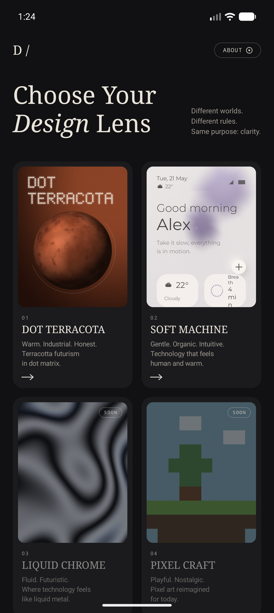
  
  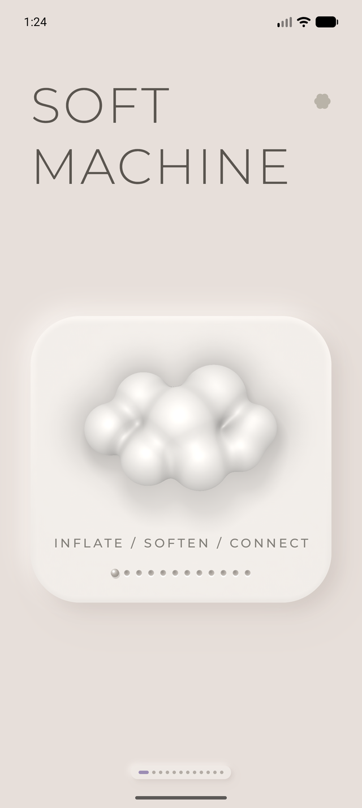
  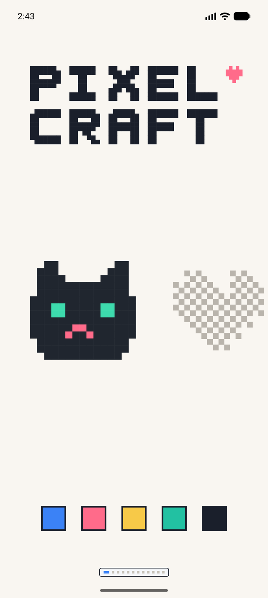
</p>

## Dot Terracota

Warm industrial: dot matrix type, brushed metal, glowing tubes, clay.

| | |
|---|---|
|  | **The subwoofer.** Tap it and it goes *thump*. The membrane pumps, the port breathes, the lights kick. Tap the orange circle and the lights turn off. Weirdly satisfying. |
|  | **The knob.** You can spin it. It clicks as it turns. The clay rotates but the lighting stays still, which is the thing that makes your brain accept it as an object. It controls a number that does nothing. |
|  | **The type.** Poke the dots and they run away from your finger, then wobble back. Drag and they follow you around like confused ducklings. I have spent an embarrassing amount of time doing this. |
|  | **The controls.** The toggles toggle. The slider slides. The little sun dims when you drag brightness down. |

<p align="center">
  
  
  
  
</p>

## Soft Machine

Lavender neumorphism: warm greige, mauve, Montserrat, everything molded and squeezable. The colors are sampled from the reference board, not eyeballed. I learned that lesson the hard way.

| | |
|---|---|
| 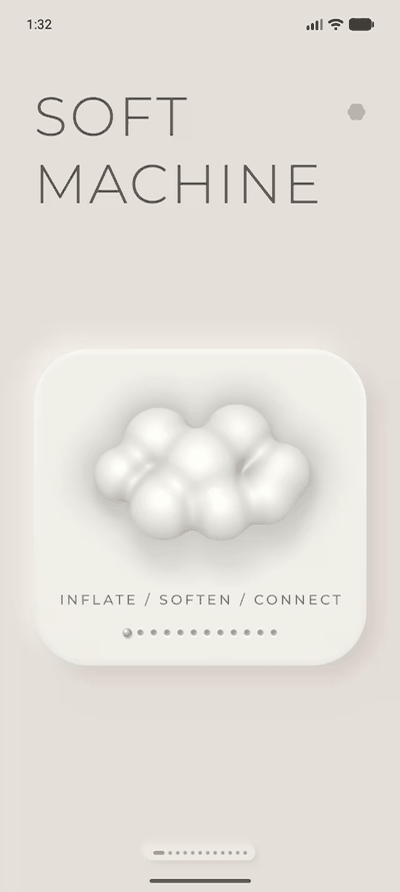 | **The cloud.** A raymarched blob of smooth-min spheres with real ambient occlusion and soft shadows, rendered live in a fragment shader. Tap it and it squishes like a marshmallow. |
| 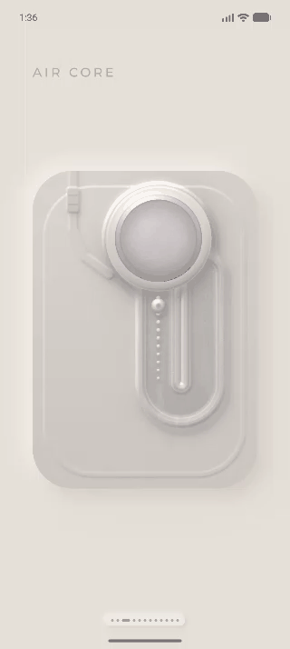 | **The air core.** A thermoformed blister pack: felt knob, double-walled plastic moulding, a racetrack pressure channel. The puck actually slides along the channel, and the bead chain parts around it. |
| 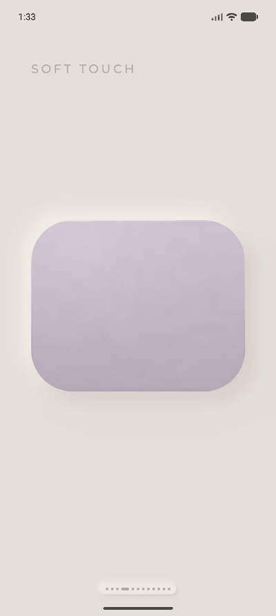 | **The silicone.** Pristine until you touch it. A quick tap makes a soft shallow dent. Hold, and your finger keeps sinking. Let go and it springs back with a wobble. |
| 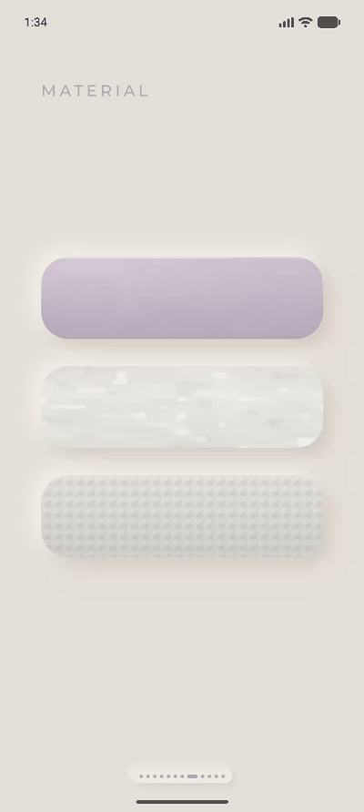 | **The textures.** Each material answers touch in its own physics. Silicone sinks slowly. Glass doesn't dent at all: your finger wipes the frost clear, and the fog re-condenses after you leave. The micro bumps flatten fast, snap back crisply, and tick under a dragging finger. |

<p align="center">
  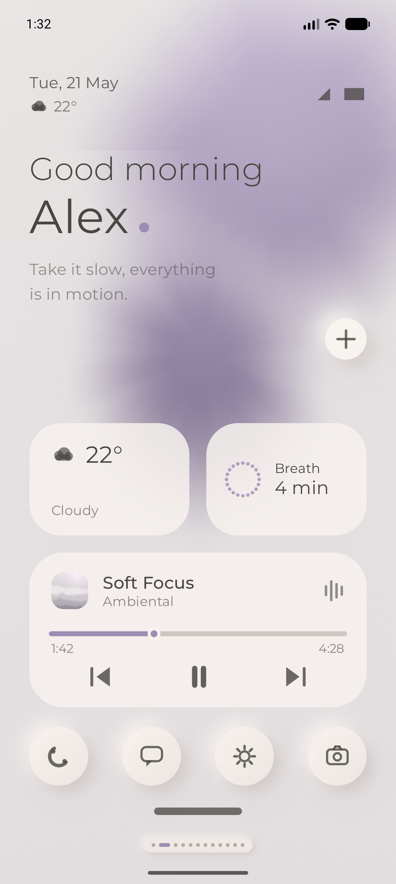
  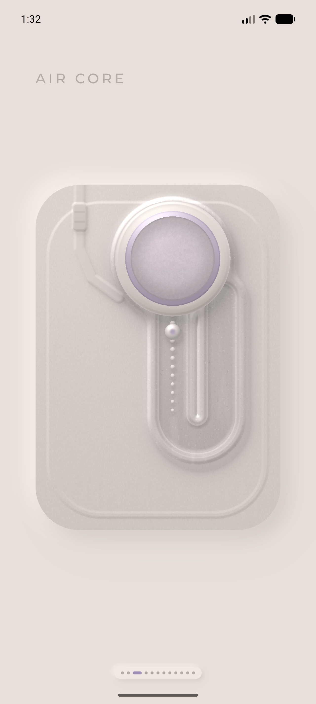
  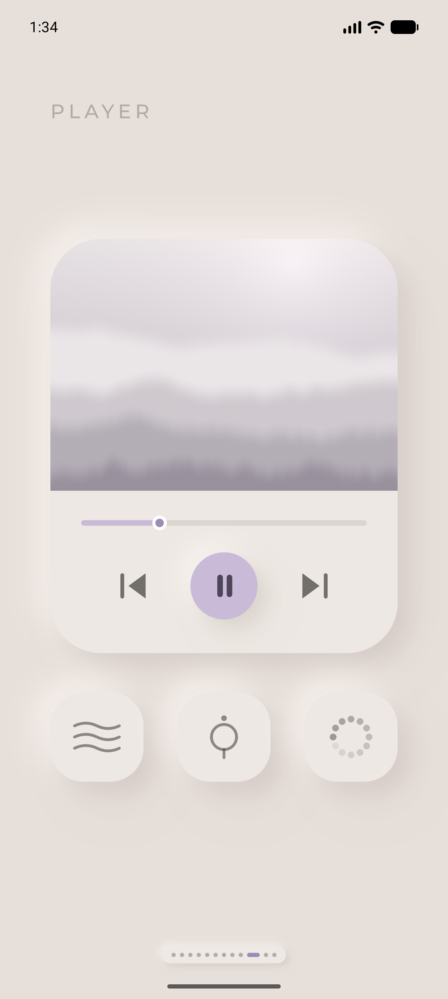
  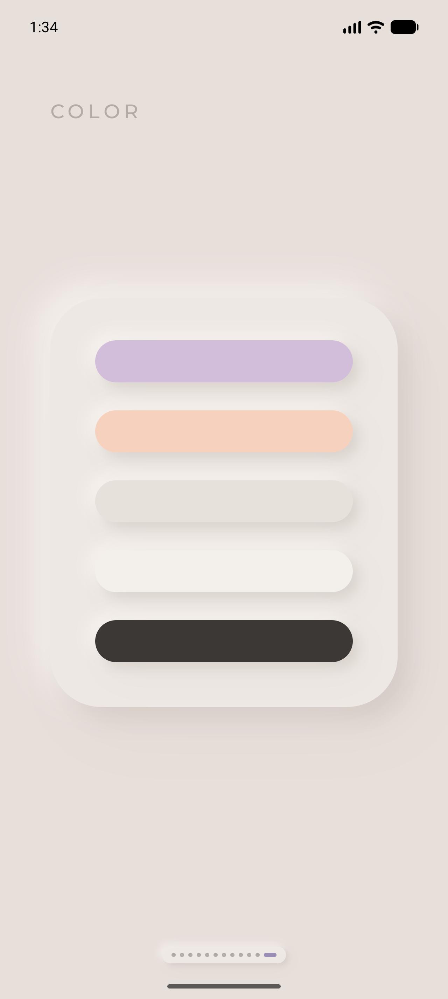
</p>

## Pixel Craft

Playful pixel art: a cat, a sailboat, chunky toggles, hard shadows. No shaders in this one at all. Every sprite is a little grid of characters typed into the source, and a seeded random number generator places every star and window so the city looks the same every time you open it.

| | |
|---|---|
| 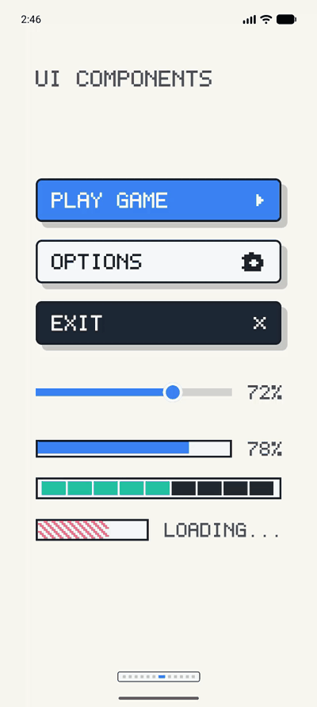 | **The buttons.** Nothing eases in this style. Press a button and it drops onto its own shadow in a single frame, then pops back up. The slider doesn't slide, it snaps between 24 steps and ticks at every one. |
| 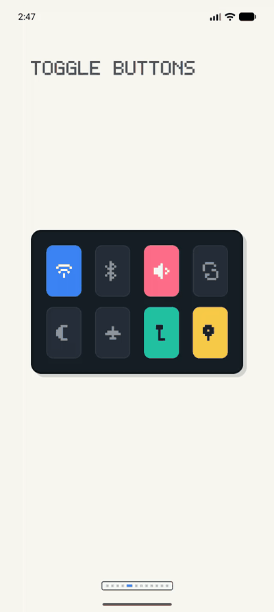 | **The toggles.** Off one frame, on the next. No spring, no fade. It feels like flipping a real switch, which is the whole point. |
| 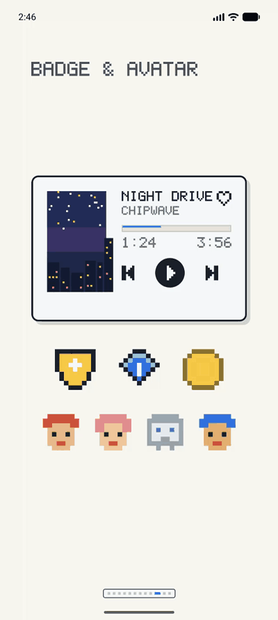 | **The player.** Tap the heart and it fills in pink. The play button presses like everything else here: down, up, done. |
| 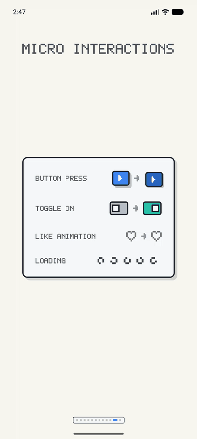 | **The micro interactions.** A little zoo of the moves the style is allowed to make. The spinner rotates through five drawn frames. That's the entire animation budget. |

<p align="center">
  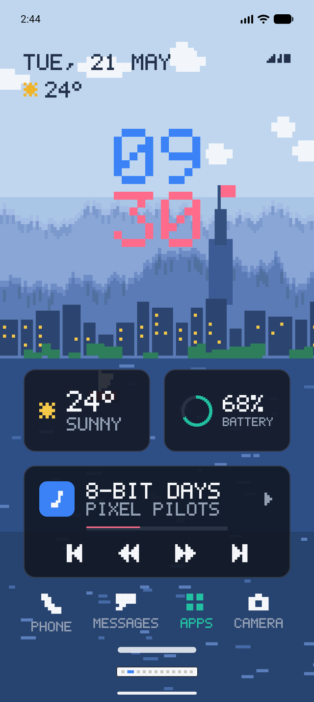
  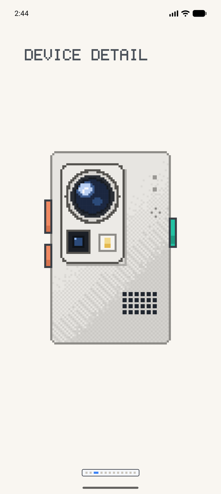
  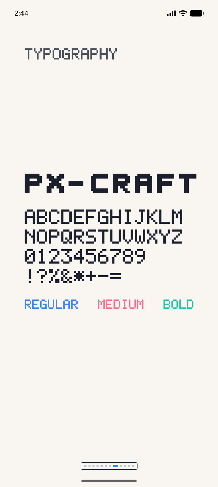
  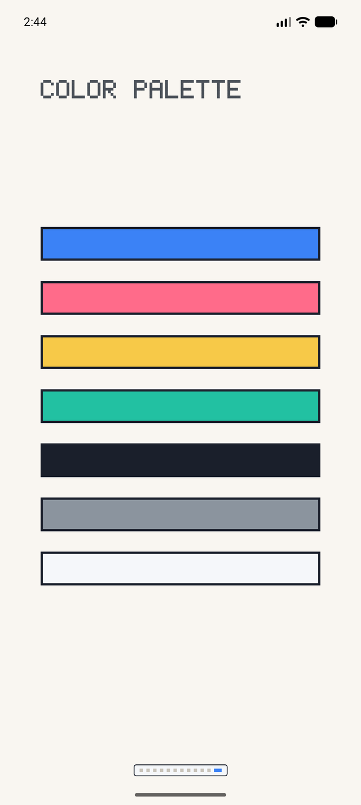
</p>

## How it's drawn

Two tools:

**Shaders** for anything that should feel like a material: brushed metal, screws, glow tubes, clay, the planet, the raymarched cloud, the blister pack, silicone, milky glass. They're resolution independent, so the same shader draws a tiny landing-card preview or a full screen and doesn't care. Interactive ones take extra uniforms (`uPulse`, `uKnob`, `uTouch`) that Compose feeds from spring animations.

**Canvas** for anything that should feel like UI: the dot matrix font (a 5×7 grid I typed in by hand, letter by letter, like it's 1982), progress dots, equalizers, icons, the spinny bits. Pixel Craft is Canvas all the way down. It has its own 5×7 font plus a heavier display face, and about forty sprites that live in the source as strings of characters, one character per pixel.

One layout trick: every screen is designed in made-up units, and I rescale `LocalDensity` so those units fill whatever screen you have. No responsive logic anywhere.

## Running it

Open it in Android Studio and press the green triangle. Or:

```
./gradlew assembleDebug
```

minSdk is 33, because `RuntimeShader`. Sorry.
