# Dot Terracota

I saw a pretty terracotta moodboard and got completely carried away. This is an Android app where everything is drawn with code: the metal, the glowing tubes, the little planet, the clay knob. There is not a single PNG in this repo. I checked.

Compose draws the UI bits. AGSL shaders draw the stuff that pretends to be physical. That's the whole trick.

<p align="center">
  
  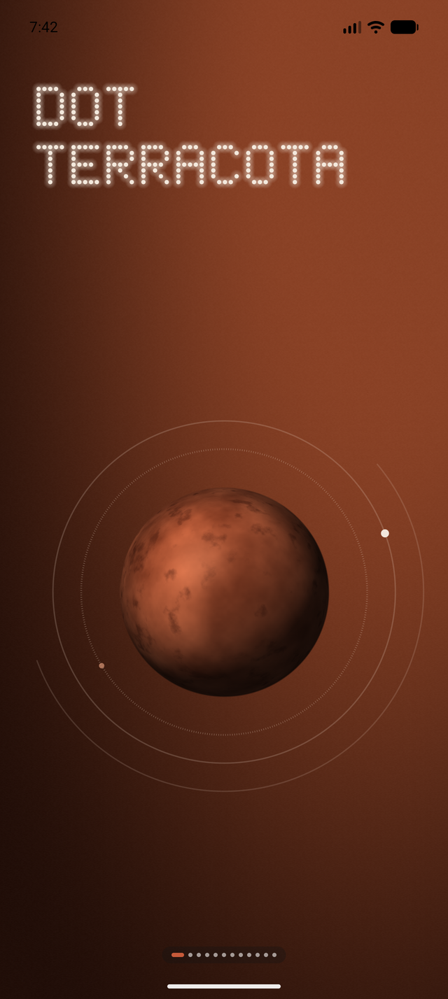
  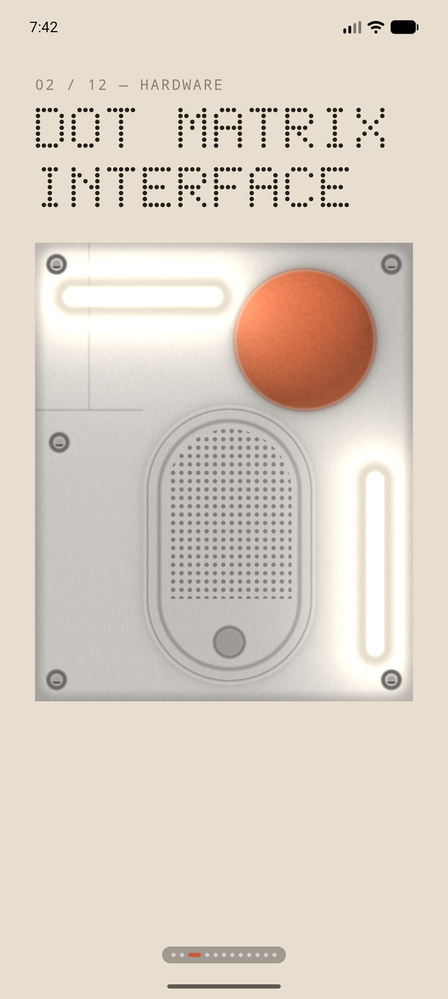
</p>

## Play with it

Everything here is poke-able. This is the part I'm most pleased with and also the part with the least practical value.

| | |
|---|---|
|  | **The subwoofer.** Tap it and it goes *thump*. The membrane pumps, the port breathes, the lights kick. Tap the orange circle and the lights turn off. That's it. That's the feature. It's weirdly satisfying. |
| 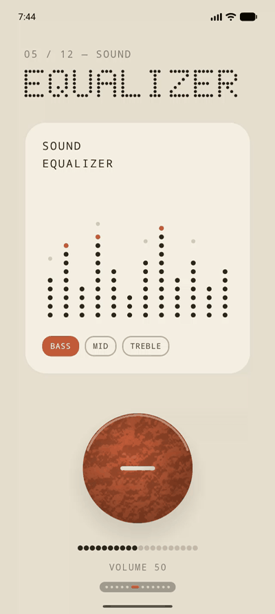 | **The knob.** You can spin it. It clicks as it turns. The clay rotates but the lighting stays still, which is the thing that makes your brain accept it as an object. It controls a number that does nothing. |
| 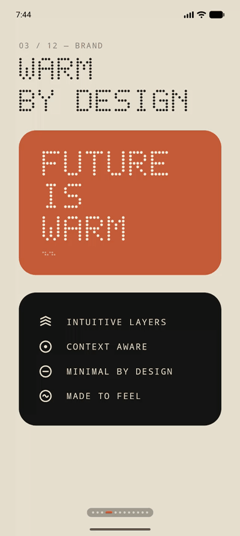 | **The type.** Poke the dots and they run away from your finger, then wobble back. Drag and they follow you around like confused ducklings. I have spent an embarrassing amount of time doing this. |
|  | **The controls.** The toggles toggle. The slider slides. The little sun dims when you drag brightness down, which nobody asked for, but here we are. |

## The screens

Twelve of them, one swipe apart. This started as one giant poster crammed onto a single screen, which looked impressive and read like an eye test. So everything got its own room.

<p align="center">
  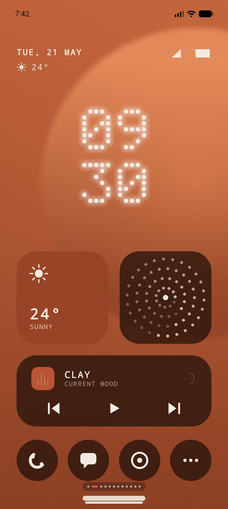
  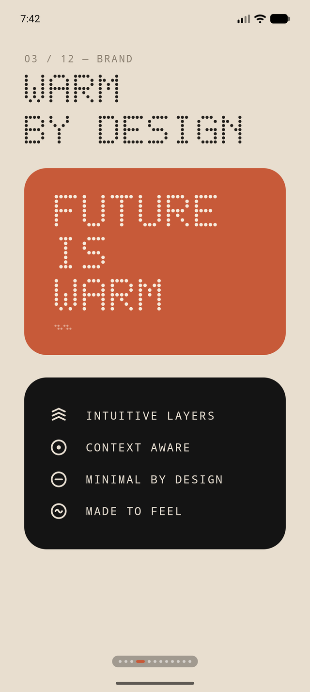
  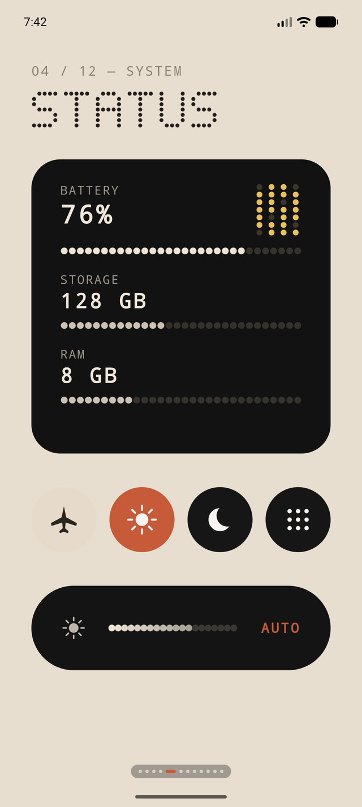
  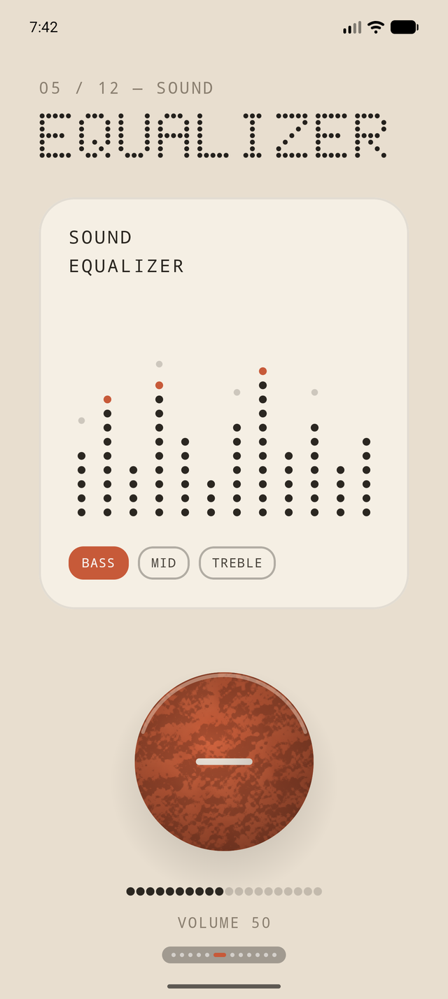
</p>
<p align="center">
  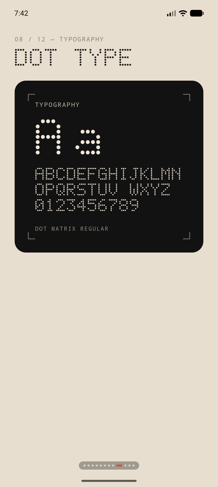
  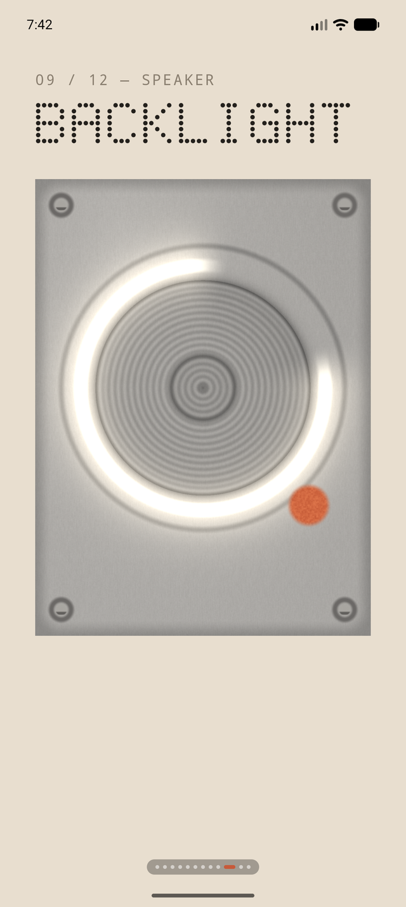
  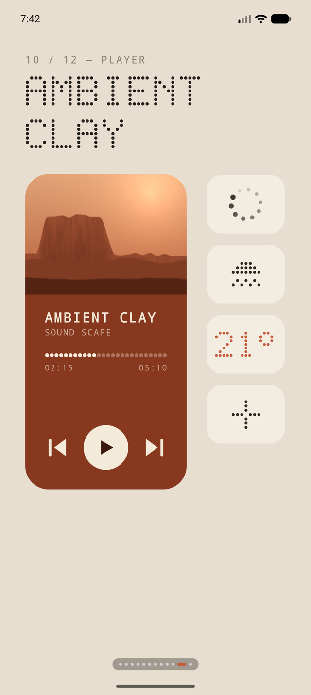
  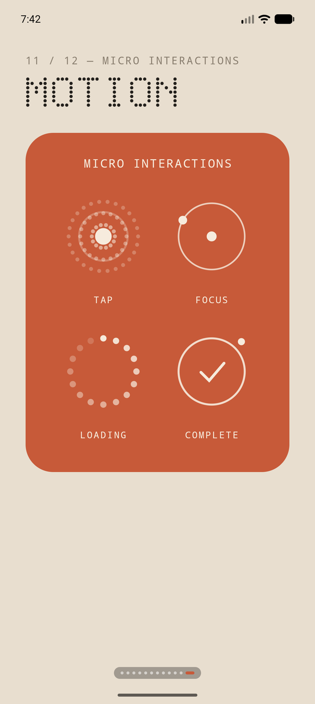
</p>

## How it's drawn

Two tools, split by vibe:

**Shaders** for anything that should feel like a material: brushed metal, screws, glow tubes, clay, the planet, the Mars landscape in the player. They're resolution independent, so the same shader draws a tiny card or a full screen and doesn't care. The interactive ones take a couple of extra uniforms (`uPulse`, `uLight`) that Compose feeds from spring animations. That's the entire subwoofer.

**Canvas** for anything that should feel like UI: the dot matrix font (a 5×7 grid I typed in by hand, letter by letter, like it's 1982), the progress dots, the equalizer, the icons, the spinny bits.

One layout trick: every screen is designed in made-up units, and I rescale `LocalDensity` so those units fill whatever screen you have. No responsive logic anywhere. It's a poster trick. It works great.

## Running it

Open it in Android Studio and press the green triangle. Or:

```
./gradlew assembleDebug
```

minSdk is 33, because `RuntimeShader`. Sorry.
